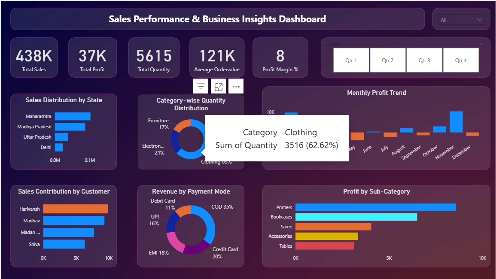

# Sales Performance & Business Insights Dashboard

This Power BI dashboard provides a comprehensive overview of sales performance, profitability, customer trends, and regional insights. It enables businesses to monitor KPIs, identify growth opportunities, and make data-driven decisions.

# Project Overview

The dashboard analyzes sales transactions to uncover:

* Revenue and profit performance

* Customer purchasing behavior

* Regional sales distribution

* Category & sub-category profitability

* Payment mode trends

* Monthly profit patterns

This report helps stakeholders quickly understand business performance and identify areas for improvement.

# Key KPIs

✔ Total Sales
✔ Total Profit
✔ Total Quantity Sold
✔ Average Order Value
✔ Profit Percentage

These KPIs provide a quick snapshot of overall business health.

# Visualizations Included
🔹 Profit Trends

* Profit by Month (Stacked Column Chart)
→ Shows monthly profitability patterns and seasonality.

🔹 Product Performance

* Profit by Sub-Category (Stacked Bar Chart)
→ Identifies top and underperforming products.

* Quantity by Category (Pie Chart)
→ Displays category demand distribution.

🔹 Regional Insights

* Sales Amount by State (Stacked Bar Chart)
→ Highlights high-performing regions.

🔹 Customer Insights

* Sales Contribution by Customer (Clustered Bar Chart)
→ Identifies key revenue-generating customers.

🔹 Payment Trends

* Sales by Payment Mode (Pie Chart)
→ Shows customer payment preferences.

# Filters & Interactivity

The dashboard includes interactive slicers for:

✔ Quarter Selection
✔ State Selection

These filters allow dynamic analysis and deeper insights.

# Tools Used

Power BI → Data visualization & dashboard design

Data Modeling → Measures & calculated metrics

DAX → KPI calculations and aggregations

# Business Insights Enabled

- Identify profitable products and categories
- Track monthly profit performance
- Discover top customers driving revenue
- Analyze regional sales strengths
- Understand customer payment behavior
- Monitor overall business profitability

# Dashboard Preview

# How to Use

1. Download the .pbix file from this repository

2. Open using Power BI Desktop

3. Use slicers to explore insights interactively

# Project Purpose

This project demonstrates my ability to:

- Build interactive Power BI dashboards
- Design meaningful business KPIs
- Perform sales and profitability analysis
- Deliver actionable business insights
